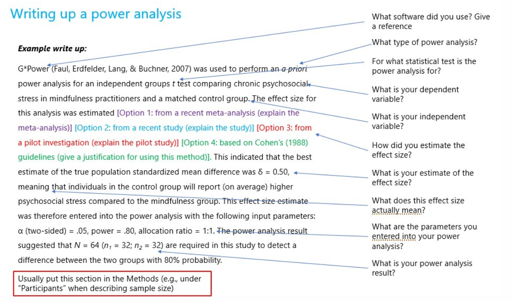

```{r setup, include=FALSE}
## --- learnr ---
if ("learnr" %in% (.packages()))
  detach(package:learnr, unload = TRUE)
library(learnr)
knitr::opts_chunk$set(echo = FALSE)

## ---- Other packages ----
library(pwr)
```

## Motivation
### Why should we do a power analysis?
-   Allocate sufficient resources to data collection:
    -   Find balance between too small N (failure to detect true effects) and too large N (waste of resources)
-   Helps thinking through experimental design and statistical analysis before data collection  
-   Often required as part of grant proposals

### What are the challenges in doing a power analysis?
-   Based on assumptions and educated guesses
-   Does not generalize well across different methods of data collection or analysis

### What types of power analyses can we do?
Ideally...

-   **A priori power analysis** (before data collection)
    -   What is the **minimal sample size** of a statistical test to detect an expected ***effect size*** with a given ***power*** and ***significance level***?
    
Other types that are often conducted...

-   **Post hoc power analysis** (after data collection)
    -   What is the observed **power** of a statistical test given the ***effect size***, the ***sample size***, and the ***significance level***?
    -   But this analysis does not provide additional information (Hoenig & Heisey 2001, Lakens 2022)
        -   Observed power is directly related to the observed significance level ("p-value") of a statistical test
        -   Nonsignificant p-values always correspond to low observed power
        -   E.g., for a z-test with a p-value of 0.05, observed power is always 50%
        -   Calculating observed power cannot lead to the statement "because the null hypothesis could not be rejected and the observed power was high, the data support the null hypothesis"
-   **Sensitivity power analysis** (after data collection)
    -   What is the **minimum effect size** that a statistical test was sufficiently sensitive to given the ***sample size***, the ***power***, and the ***significance level***?

## Key components
### Refresher: What are Type I and Type II errors?
|                                   | Reality: Effect present  | Reality: No effect present |
|-----------------------------------|:-----------------------:|:--------------------------:|
|   **Test indicates: Effect present**  |      True Positive (1-$\beta$)     |       False Positive  ($\alpha$, Type I error)     |
| **Test indicates: No effect present** |      False Negative ($\beta$, Type II error)    |        True Negative (1-$\alpha$)      |

### A priori power analysis

#### What are the key components?
1.    Sample size
      -   To be calculated
2.    Effect size
      -   Standardized measure of the expected size/magnitude of an effect
      -   "the degree to which the phenomenon is present in the population" or "the degree to which the null hypothesis is false" (Cohen 1988)
      -   Often estimated based on previous research, a pilot study, or Cohen's recommendations
3.    Power (1 - $\beta$)
      -   Probability of detecting an effect given that the effect exists
      -   In other words: probability of rejecting $H_0$ given that it is in fact false
      -   Usual recommendation: 80%
4.    Significance level ($\alpha$)
      -   Probability of detecting an effect given that the effect does not exist
      -   In other words: probability of rejecting $H_0$ given that it is in fact true
      -   Usual recommendations: 5%, 1%, 0.1%

#### What is the relationship between the components?
-   Example: difference-in-means estimate based on two groups of same size with homogeneous variance
-   $1-\beta = \Phi\left(\frac{|\mu_t-\mu_c|\sqrt{N}}{2\sigma}-\Phi^{-1}(1-\frac{\alpha}{2})\right)$
-   Notation:
    -   $1-\beta$ = power
    -   $\Phi$ = normal cumulative distribution function (CDF)
    -   $\mu_t$ and $\mu_c$ = expected means of the outcome variable in the treatment and control groups
    -   $N$ = sample size
    -   $\sigma$ = standard deviation of continuous outcome variable
    -   $1-\frac{\alpha}{2}$ = Type I error probability that we allow in each tail of a two-tailed test (e.g., with $\alpha$ = 0.05, we allow for a Type I error probability of 2.5\% in each tail and draw inferences at the 95\% level)
-   Power increases as... 
    -   the sample size increases
    -   the effect size increases
    -   the standard deviation of the outcome variable decreases
    -   the significance level increases

### How can we estimate the effect size?
#### 1. Based on previous research
-   Previous studies with a similar research design can provide an idea of the effect size
-   Meta-analysis can be used for effect size estimation if several similar studies exist
-   But effect sizes are often not clearly reported in publications

#### 2. Based on a pilot study
-   A pilot study can provide an estimate of the effect size, the variability in the measures, and the patterns of missing data

#### 3. Based on Cohen's recommendations
-   If the effect size cannot be estimated based on previous research or a pilot study, the following recommendations by Cohen (1988) are often used: 

|                         |     | small | medium | large |
|-------------------------|:---:|:-----:|:------:|:-----:|
| t-test for means        |  $d$  |  .20  |   .50  |  .80  |
| t-test for correlations |  $r$  |  .10  |   .30  |  .50  |
| F-test for regressions  | $f^2$ |  .02  |   .15  |  .35  |
| Chi-square tests        |  $w$  |  .10  |   .30  |  .50  |

## Practical considerations
### Do we need a power analysis for every statistical test?
-   Usually sufficient to do a power analysis for the statistical test with the smallest expected effect size
-   Power will be higher for larger effect sizes, holding the sample size and significance level constant
-   But consider the problem of multiple testing:
    -   Can apply Bonferroni correction (or similar method) to address this issue

### Are there other ways to increase power without increasing sample size?
When formulating hypotheses (ideally with preregistration)...

-   One-tailed statistical tests have higher power than two-tailed statistical tests
-   Interaction effects often require more power than main effects

When designing the experiment...

-   Experimental designs with fewer conditions have higher power than those with more conditions
-   Within-subject experimental designs have higher power than between-subject experimental designs
-   Balanced experimental designs have higher power than unbalanced designs

When designing the questionnaire...

-   Survey measures with high reliability/low measurement error lead to higher power
-   Missing data lead to lower power

When analyzing the data...

-   Imputing missing data can lead to higher power

### How should we write up the power analysis in a paper?
-   Power analyses should be reproducible and justified

{width="80%"}

Source: https://twitter.com/GuyProchilo/status/1292780240977223681/photo/1

## Analytic power calculation
-   pwr package in R (Champely 2020)
-   G\*Power Software (Faul et al. 2007)

### pwr package
-   Functions to carry out power analyses for different statistical tests:
    -   `pwr::pwr.p.test()`: one-sample proportion test
    -   `pwr::pwr.2p.test()`: two-sample proportion test
    -   `pwr::pwr.2p2n.test()`: two-sample proportion test (unequal sample size)
    -   `pwr::pwr.t.test()`: two-sample, one-sample, and paired t-test
    -   `pwr::pwr.t2n.test()`: two-sample t-test (unequal sample size)
    -   `pwr::pwr.r.test()`: correlation test
    -   `pwr::pwr.chisq.test()`: chi-squared test
    -   `pwr.f2.test()`: test for the general linear model

-   Power curves (power as a function of sample size) can be plotted using `plot()`
    
#### Example
We are conducting a student satisfaction survey at the University of Mannheim and are interested to know if a Café Soleil voucher (5 Euro) as a conditional incentive increases the survey response rate. 

The incentive is announced for half of the sample in the invitation email and not announced for the other half. 

For each student, we observe whether they participated in the survey $(Y=1)$ or not $(Y=0)$. We will test for a difference in proportions using a two-sample t-test.

What is the **minimal sample size** to detect an effect in either direction with a ***power of 80%*** and a ***significance level of 5%***?

1. Estimate effect size

-   Option 1: calculate effect size for proportions based on a pilot study

```{r ex1, exercise=TRUE}
ES.h(p1 = 0.3, p2 = 0.2)
# Effect size = 2*asin(sqrt(p1))-2*asin(sqrt(p2))
```

-   Option 2: based on Cohen's recommendations

```{r ex2, exercise=TRUE}
cohen.ES(test = "p", size = "small")
```

2. Calculate power for two proportions (equal sample size)

```{r ex3, exercise=TRUE}
pwr.2p.test(h = 0.2, n = NULL, sig.level = 0.05, power = 0.8, alternative = "two.sided")
```

3. Plot power as a function of sample size

```{r ex4, exercise=TRUE}
plot(pwr.2p.test(h = 0.2, n = NULL, sig.level = 0.05, power = 0.8, alternative = "two.sided"))
```

### G*Power
-   Free software for power calculation available for Windows and Mac
-   Can be downloaded from https://www.psychologie.hhu.de/arbeitsgruppen/allgemeine-psychologie-und-arbeitspsychologie/gpower.html

{width="80%"}

-   Power analyses can be carried out and plotted for different statistical tests:
    1.    Select statistical test
    2.    Select type of power analysis
    3.    Provide input parameters and click "Calculate"

## References
-   Bauer, P. & Cohen, D. (in preparation). *Applied Causal Analysis with R*
-   Champely, S. (2020). pwr: Basic Functions for Power Analysis. R package version 1.3-0.
  https://CRAN.R-project.org/package=pwr.
-   Cohen, J. (1988). *Statistical Power Analysis for the Behavioral Sciences*, Second Edition. Hillsdale, NJ:  Lawrence Erlbaum Associates.
-   Faul, F., Erdfelder, E., Lang, A.-G., & Buchner, A. (2007). G\*Power 3: A flexible statistical power analysis program for the social, behavioral, and biomedical sciences. *Behavior Research Methods, 39*, 175-191.
-   Hoenig, J. M. & Heisey, D. M. (2001). The abuse of power: The pervasive fallacy of power calculations for data analysis.*The American Statistician, 55*(1), 19-24.
-   Lakens, D. (2022). Sample size justification. *Collabra: Psychology, 8*(1).
-   Schönbrodt, F. & Fischer, M. (2023). Advanced Power Analysis. Available at https://osf.io/t5rjf/.
-   UCLA Statistical Consulting (2023). Introduction to Power Analysis. Available at https://stats.oarc.ucla.edu/other/mult-pkg/seminars/intro-power/.
